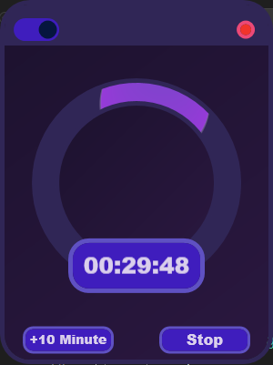

# ProdactiveTimerUI
Simple timer up that should help to focus with productivity
the software has timer that helping you determinate if u worked the minimum time you have been defined
the software have no restart button or anything like that to make sure you want decrease the time

> App made in WPF Core .net7
> has a dark mode
> also when the screen minimized the animation is stopped and the system low usage of resources while minimized
>

## Screenshot
 
# License
> The MIT License
